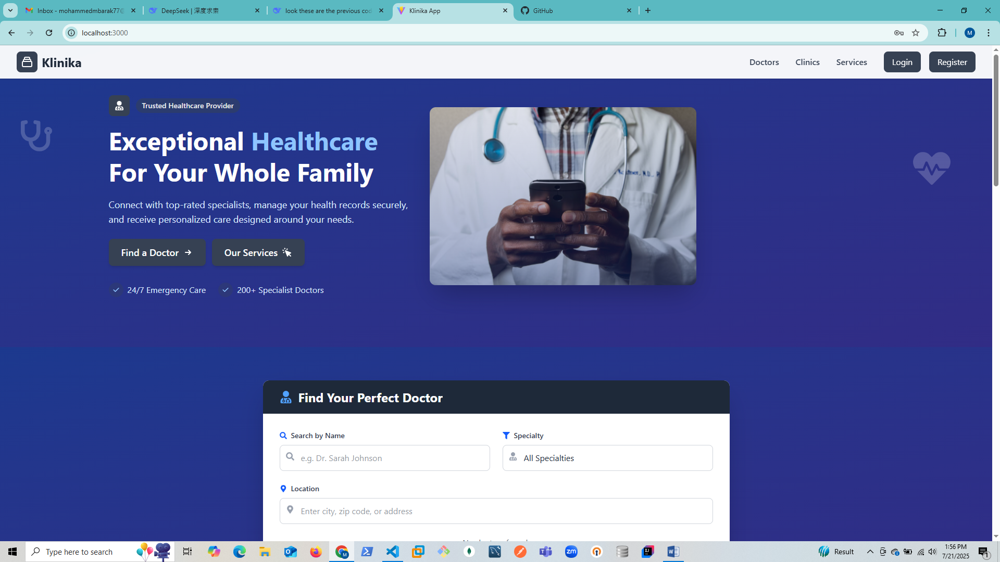

# 🏥 NOVAHEALTH – Clinic Appointment Booking System

NovaHealth is a full-stack appointment booking system built with the **MERN stack**. It enables patients to schedule appointments with clinics or doctors, while admins and staff can manage clinics, appointments, and doctors in real time. This system is ideal for small to medium-sized healthcare providers.

---

## 🌐 Live Demo

🚀 Frontend: [_novahealth.onrender.com_](https://novahealth.onrender.com)

---

## 📸 Screenshot

Here’s a glimpse of the homepage UI:



---

## 📁 Project Structure

klinika/  
├── client/ # Frontend (React + Vite + TypeScript)  
│ ├── components/ # Shared and page-specific components  
│ ├── pages/ # Views (auth, clinics, dashboard, etc.)  
│ ├── services/ # API service functions (e.g. axios)  
│ ├── hooks/ # Custom hooks  
│ └── ...  
│  
├── server/ # Backend (Express.js + MongoDB)  
│ ├── config/ # DB configuration  
│ ├── controllers/ # Business logic for routes  
│ ├── models/ # Mongoose models  
│ ├── routes/ # API endpoints  
│ ├── middlewares/ # Auth, error handler, etc.  
│ └── ...  
│  
├── .env # Environment variables (ignored by Git)  
├── .gitignore # Git ignored files  
├── README.md # Project documentation  
├── package.json # Optional monorepo-level tooling  
└── klinika-homepage.png # Project screenshot

---

## 🛠️ Features

- 🔐 Secure Authentication (JWT-based: Register, Login, Reset Password)  
- 🩺 Appointment Booking by Patients  
- 📋 View and Manage Appointments  
- 🧑‍⚕️ Admin Dashboard for Managing Doctors, Clinics & Schedules  
- 📅 Calendar-based appointment management  
- 🧘 Responsive UI with TailwindCSS and TypeScript  
- 🔄 REST API with Express.js and MongoDB  

---

## ⚙️ Tech Stack

### 🔹 Frontend  
- React + Vite + TypeScript  
- React Router DOM  
- Axios  
- TailwindCSS  

### 🔹 Backend  
- Node.js + Express.js  
- MongoDB + Mongoose  
- JWT Authentication  
- bcrypt, express-async-handler, dotenv  

---

## 🚀 Getting Started

### 1. Clone the Repository

```bash
git clone https://github.com/Mbarak-jr/KLINIKA.git
cd KLINIKA
2. Install Dependencies
Backend
bash
Copy
Edit
cd server
npm install
Frontend
bash
Copy
Edit
cd ../client
npm install
3. Create .env Files
In server/.env:

env
Copy
Edit
PORT=5000
MONGO_URI=your_mongo_connection_string
JWT_SECRET=your_jwt_secret
In client/.env:

env
Copy
Edit
VITE_API_URL=http://localhost:5000/api
4. Run the App Locally
Start Backend
bash
Copy
Edit
cd server
npm run dev
Start Frontend
bash
Copy
Edit
cd client
npm run dev
Access the app at http://localhost:3000

🧪 Testing
Backend routes can be tested using Postman or Thunder Client.

Frontend functionality can be verified through the browser.

Add unit/integration tests with tools like Jest, React Testing Library, or Supertest.

🧑‍💻 Contributing
Contributions are welcome! Fork the repo and create a pull request.

📄 License
This project is licensed under the MIT License.

🙌 Acknowledgements
Built with MERN Stack ❤️

UI inspired by common medical admin dashboards

vbnet
Copy
Edit
